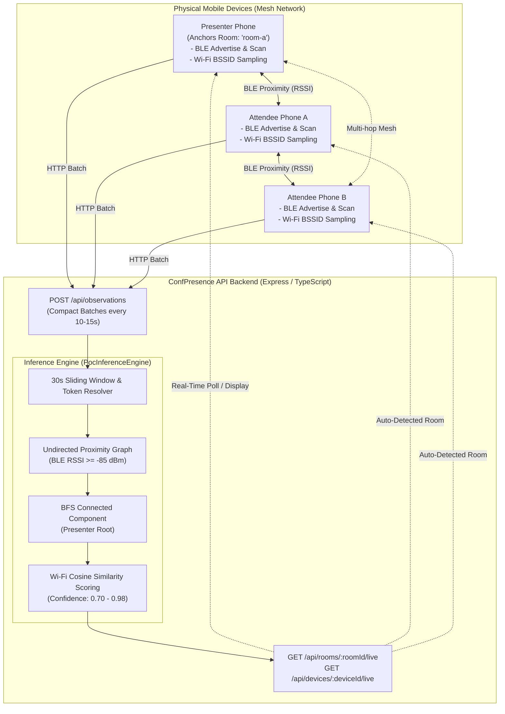

# XConnect 🎯

> **Zero-Hardware, Privacy-First Indoor XConnect Presence & Room Clustering System**

[](https://nodejs.org/)
[](https://pnpm.io/)
[](https://www.typescriptlang.org/)
[](https://reactnative.dev/)
[](https://expo.dev/)
[](https://kotlinlang.org/)
[](https://developer.apple.com/swift/)

---

## 📖 Overview

**XConnect** is an Android & IOS, zero-infrastructure proof-of-concept system for indoor conference and meeting presence tracking. 

Traditional attendance and location-tracking systems require expensive physical hardware beacons, NFC/RFID gates, QR-code queues, or intrusive GPS (which fails indoors). ConfPresence ZERO eliminates all external hardware by using **peer-to-peer mobile BLE mesh discovery**, **ambient Wi-Fi BSSID fingerprinting**, and **graph clustering / label propagation** on the backend.

### Key Highlights

- 🚫 **Zero Hardware Infrastructure**: No fixed beacons, routers, or NFC scanners required.
- 📱 **Peer-to-Peer BLE Mesh**: Participant phones simultaneously broadcast rotating pseudonymous tokens and scan nearby peer signals.
- 📶 **Dual-Sensor Fusion (BLE + Wi-Fi)**: Fuses short-range BLE RSSI proximity with ambient Wi-Fi BSSID cosine similarity vectors to eliminate room wall bleed-through.
- 🔒 **Privacy-by-Design**: No Bluetooth MAC addresses or personally identifiable hardware serials are broadcast or stored. Ephemeral rotating tokens change every 60 seconds.
- 🏷️ **Presenter-Anchored Graph Clustering**: The presenter anchors a room label (e.g., `room-a`, `Auditorium`). Connected peer graph algorithms infer attendee presence dynamically in real time.
- ⚡ **Live Real-Time Dashboard**: Presenters and attendees get sub-30-second live room roster updates.

---

## 🏗️ Architecture & Data Flow



---

## 📂 Repository Workspace Structure

This monorepo is managed using **pnpm workspaces**:

```text
├── apps/
│   ├── api/                     # Node.js + Express 5 + TypeScript backend service
│   │   ├── src/
│   │   │   ├── index.ts         # REST API routes & Zod validation schemas
│   │   │   ├── inference.ts     # In-memory graph clustering & Wi-Fi fusion engine
│   │   │   └── test_wifi_inference.ts # Unit tests for inference & cosine similarity
│   │   ├── package.json
│   │   └── tsconfig.json
│   └── mobile/                  # React Native 0.81.5 + Expo 54 client application
│       ├── android/             # Native Android project with custom BLE & Wi-Fi modules
│       │   └── app/src/main/java/com/confpresence/zero/
│       │       ├── ble/ConfPresenceBleModule.kt   # Native Kotlin BLE Advertise/Scan
│       │       └── wifi/ConfPresenceWifiModule.kt # Native Kotlin Wi-Fi Scanner
│       ├── ios/                 # Native iOS Swift/ObjC modules
│       ├── src/
│       │   ├── native/          # TypeScript native bridge wrappers
│       │   └── services/        # Presence service & device identity manager
│       ├── App.tsx              # Main UI with Presenter/Attendee modes & Live Roster
│       ├── app.json             # Expo configuration
│       └── package.json
├── packages/
│   └── shared/                  # Shared TypeScript types, interfaces, & contracts
│       ├── src/index.ts         # PresenceBatch, LiveRoomState, RoomMemberInfo, etc.
│       └── package.json
├── docs/                        # Specifications, test plans, and architectural designs
│   ├── HIGH_LEVEL_DESIGN.md     # In-depth architectural blueprint
│   ├── ARCHITECTURE_GAP_ANALYSIS_AND_ROADMAP.md # Future roadmap & scaling plan
│   ├── POC_SCOPE.md             # Core POC scope & acceptance criteria
│   ├── ANDROID_BLE_MODULE.md    # Android native integration guide
│   └── TEST_PLAN.md             # Multi-device testing procedures
├── work/                        # Python analysis & report generation scripts
│   ├── create_confpresence_report.py
│   └── render_pdf.py
├── Dockerfile                   # Production container build for API
├── render.yaml                  # Render.com cloud deployment blueprint
├── pnpm-workspace.yaml          # Monorepo workspace configuration
└── package.json                 # Root monorepo scripts
```

---

## ⚙️ Prerequisites

Before getting started, make sure your development environment has the following installed:

1. **Node.js**: `v20.0.0` or higher (LTS recommended).
2. **pnpm**: `v10.0.0` or higher.
   ```bash
   npm install -g pnpm
   ```
3. **Git**: Installed and configured.
4. **Android Development Tools** (for mobile client testing):
   - **Android Studio** (Hedgehog / Iguana / Jellyfish / Ladybug).
   - **Android SDK** (API level 34 or 35).
   - **JDK 17** (Java Development Kit).
   - **Android Device**: At least **2 physical Android smartphones** running Android 8.0+ (API 26+) with Bluetooth Low Energy and Wi-Fi enabled.
   > ⚠️ **Important:** BLE Advertising and Scanning **cannot be tested in an Android Emulator or Expo Go**. You must use physical devices with a development build.
5. **iOS Development Tools** (Optional / macOS only):
   - Xcode 15+ and CocoaPods.

---

## 🚀 Step-by-Step Local Setup & Execution Guide

Follow these steps in order to clone, configure, build, and run ConfPresence Zero locally.

### Step 1: Clone the Repository

```bash
git clone https://github.com/WCTHLS/ConfPresence-Zero.git
cd ConfPresence-Zero
```

### Step 2: Install Monorepo Dependencies

Install all dependencies across all packages and apps using `pnpm`:

```bash
pnpm install
```

---

### Step 3: Configure Environment Variables

The mobile devices need to communicate with the API backend over your local Wi-Fi network (LAN).

1. Find your machine's local LAN IP address:
   - **Windows**: `ipconfig` (look for IPv4 Address under Wi-Fi, e.g., `192.168.1.150`).
   - **macOS / Linux**: `ifconfig` or `ip a` (e.g., `192.168.1.150`).

2. Create `apps/mobile/.env` (or configure via the in-app server settings UI):
   ```bash
   cp .env.example apps/mobile/.env
   ```

3. Update `apps/mobile/.env` with your LAN IP:
   ```env
   EXPO_PUBLIC_API_URL=http://192.168.1.150:3000
   API_PORT=3000
   ```

---

### Step 4: Run the Backend API

Start the Express API server in development mode (with hot reloading via `tsx watch`):

```bash
pnpm dev:api
```

*Or run from root:*
```bash
pnpm --filter @confpresence/api dev
```

The API will start listening on:
```text
ConfPresence POC API listening on http://0.0.0.0:3000
```

#### Verify Backend Health
Open your browser or run:
```bash
curl http://localhost:3000/health
# Response: {"ok":true}
```

#### Run Backend Inference Engine Tests
To verify the graph clustering and dual-sensor Wi-Fi similarity algorithm:
```bash
pnpm --filter @confpresence/api test
```
*Expected Output:*
```text
1. Joining Presenter and Attendees...
2. Ingesting Presence Batches...
3. Querying Room State for 'room-a'...
4. Validations:
Bob (Matching WiFi): similarity = 0.99, confidence = 0.97
Charlie (No WiFi): similarity = undefined, confidence = 0.85
Diana (Different WiFi): similarity = 0, confidence = 0.7
✅ All Wi-Fi inference unit tests PASSED successfully!
```

---

### Step 5: Build and Run the Mobile App (Physical Android Device)

Connect your physical Android phone via USB with **USB Debugging** enabled.

1. Verify device connection:
   ```bash
   adb devices
   ```

2. Build and launch the Android development build:
   ```bash
   pnpm --filter @confpresence/mobile android
   ```
   *This compiles the native Kotlin modules (`ConfPresenceBleModule.kt` and `ConfPresenceWifiModule.kt`), installs the APK to your connected phone, and starts the Metro development bundler.*

3. If you want to start the Metro bundler separately:
   ```bash
   pnpm --filter @confpresence/mobile start
   ```

---

## 🧪 Multi-Device Testing & Verification Procedure

To test full zero-hardware room presence clustering:

### Device 1 — Presenter Setup (e.g., Room Anchor)
1. Launch the app on Phone 1.
2. Under **Role Selection**, choose **Presenter**.
3. Set your display name (e.g., `Dr. Alice - Presenter`).
4. Select or enter a room name (e.g., `room-a`).
5. Ensure Server URL points to your host IP (`http://<YOUR-LAN-IP>:3000`).
6. Tap **Start Presence Broadcast & Scan**.
7. Grant the requested Android permissions (**Bluetooth Nearby Devices**, **Location**).
8. The presenter phone will begin advertising the rotating BLE token and listening for peers.

### Device 2 — Attendee Setup
1. Launch the app on Phone 2 (connected to the same Wi-Fi network).
2. Under **Role Selection**, choose **Attendee**.
3. Set display name (e.g., `Bob - Attendee`).
4. Tap **Start Presence Broadcast & Scan**.
5. Grant the required Bluetooth and Location permissions.
6. The attendee phone will begin scanning and advertising.

### Observing Results
- Within 15–30 seconds, Phone 2 will detect Phone 1's BLE signal and upload its observation batch.
- **Presenter View**: Phone 1's live room dashboard displays `Bob - Attendee` with high confidence (e.g., `95% - 98%`) and Wi-Fi similarity score.
- **Attendee View**: Phone 2 automatically detects that it is in `room-a` anchored to `Dr. Alice`.
- **API Terminal**: Displays real-time ingestion logs and room cluster graphs.

---

## 📡 REST API Reference

| Method | Endpoint | Description | Sample Payload |
|---|---|---|---|
| `GET` | `/health` | Server health check | — |
| `POST` | `/api/session/join` | Register device participation | `{"sessionId":"poc","deviceId":"dev-123","role":"presenter","roomId":"room-a","displayName":"Alice"}` |
| `POST` | `/api/observations` | Ingest peer BLE observations & Wi-Fi fingerprint | `{"sessionId":"poc","deviceId":"dev-123","rotatingId":"tok-abc","role":"attendee","peers":[{"rotatingId":"tok-xyz","rssi":-72,"seenAt":"2026-08-26T12:00:00Z"}],"capturedAt":"2026-08-26T12:00:00Z"}` |
| `GET` | `/api/rooms?sessionId=:id` | List active rooms in a session | — |
| `GET` | `/api/rooms/:roomId/live` | Get live room cluster & member roster | Query param: `?sessionId=poc` |
| `GET` | `/api/devices/:deviceId/live` | Query current inferred room for a device | Query param: `?sessionId=poc` |
| `POST` | `/api/session/leave` | Deregister device and purge session state | `{"deviceId":"dev-123"}` |

---

## 🔑 Native Android Permissions & BLE Specifications

### BLE Advertising Parameters
- **Service UUID**: `00007a04-0000-1000-8000-00805f9b34fb`
- **Manufacturer ID**: `0x7A04`
- **Advertise Mode**: `ADVERTISE_MODE_LOW_LATENCY`
- **Tx Power Level**: `ADVERTISE_TX_POWER_MEDIUM`
- **Scan Mode**: `SCAN_MODE_LOW_LATENCY`

### Android Permissions Declared (`AndroidManifest.xml`)
- `android.permission.BLUETOOTH_SCAN` (`usesPermissionFlags="neverForLocation"`)
- `android.permission.BLUETOOTH_ADVERTISE`
- `android.permission.BLUETOOTH_CONNECT`
- `android.permission.ACCESS_FINE_LOCATION` (Required for BLE scanning and Wi-Fi scanning on Android 11 and below)
- `android.permission.ACCESS_WIFI_STATE` & `android.permission.CHANGE_WIFI_STATE`

---

## 🐳 Docker & Cloud Deployment

### Run API with Docker Locally

1. **Build Docker Image**:
   ```bash
   docker build -t confpresence-api .
   ```

2. **Run Container**:
   ```bash
   docker run -d -p 3000:3000 --name confpresence-api confpresence-api
   ```

### Deploy to Cloud (Render.com)

The repository includes a ready-to-use [`render.yaml`](file:///c:/Users/Admin/Documents/Codex/2026-08-13/referenced-chatgpt-conversation-this-is-an-2/render.yaml) blueprint:
1. Push your repository to GitHub.
2. In the [Render Dashboard](https://dashboard.render.com), click **New +** -> **Blueprint**.
3. Connect your `ConfPresence-Zero` repository.
4. Render will automatically build the `Dockerfile` and provision the API service.

---

## 📜 Available NPM / PNPM Scripts

| Script | Command | Purpose |
|---|---|---|
| `pnpm dev:api` | `pnpm --filter @confpresence/api dev` | Start backend API in watch mode |
| `pnpm typecheck` | `pnpm -r typecheck` | Run TypeScript typechecking across all workspaces |
| `pnpm --filter @confpresence/api test` | `tsx apps/api/src/test_wifi_inference.ts` | Run inference engine test suite |
| `pnpm --filter @confpresence/mobile android` | `expo run:android` | Build and run native Android app on connected device |
| `pnpm --filter @confpresence/mobile start` | `expo start --dev-client` | Start Metro development server |
| `pnpm --filter @confpresence/mobile prebuild` | `expo prebuild --platform android` | Regenerate native Android directories |

---

## 📚 Technical Documentation & Research

For in-depth architectural analyses and engineering specifications, explore the [`docs/`](file:///c:/Users/Admin/Documents/Codex/2026-08-13/referenced-chatgpt-conversation-this-is-an-2/docs/) folder:

- 📘 [**High-Level Design Document**](file:///c:/Users/Admin/Documents/Codex/2026-08-13/referenced-chatgpt-conversation-this-Design.md): Mathematical formulations of BLE RSSI propagation, Wi-Fi cosine similarity, and graph partitioning.
- 🗺️ [**Architecture Gap Analysis & Roadmap**](file:///c:/Users/Admin/Documents/Codex/2026-08-13/referenced-chatgpt-conversation-this-is-an-2/docs/ARCHITECTURE_GAP_ANALYSIS_AND_ROADMAP.md): Production hardening, background execution strategies, and security protocols.
- 🎯 [**POC Scope & Acceptance Criteria**](file:///c:/Users/Admin/Documents/Codex/2026-08-13/referenced-chatgpt-conversation-this-is-an-2/docs/POC_SCOPE.md): Defined constraints and success metrics.
- 🧪 [**Test Plan & Benchmark Suite**](file:///c:/Users/Admin/Documents/Codex/2026-08-13/referenced-chatgpt-conversation-this-is-an-2/docs/TEST_PLAN.md): Multi-room and multi-phone validation protocols.
- 🤖 [**Android BLE Native Module Guide**](file:///c:/Users/Admin/Documents/Codex/2026-08-13/referenced-chatgpt-conversation-this-is-an-2/docs/ANDROID_BLE_MODULE.md): Integration steps for Kotlin native bridge.

---

## 📄 License

This project is licensed under the [MIT License](LICENSE).
