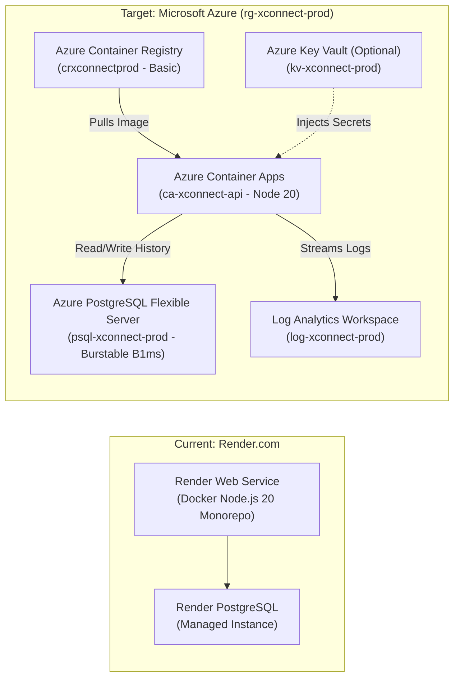
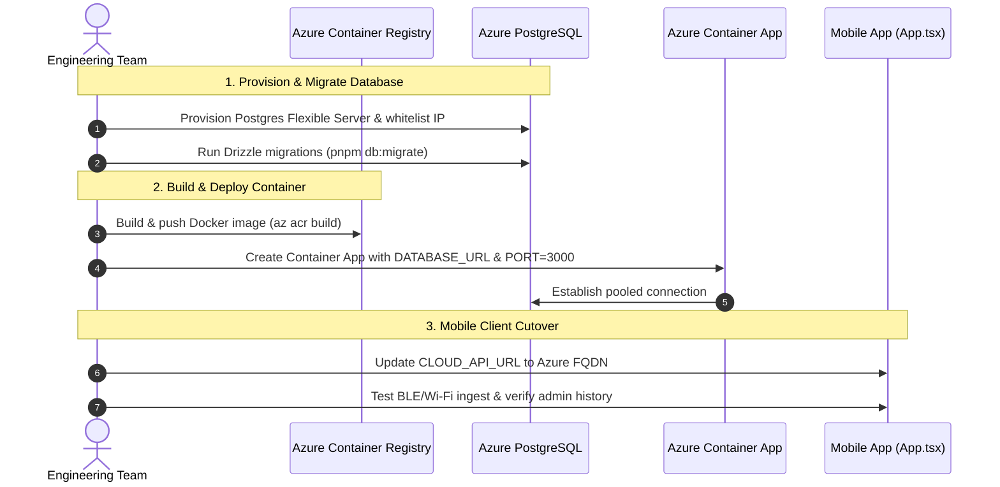

# XConnect Cloud Migration Guide: Render to Microsoft Azure ☁️🎯

> **Executive & Technical Migration Documentation**  
> **Project:** XConnect (ConfPresence Zero-Hardware Indoor Presence & Clustering System)  
> **Target Cloud Platform:** Microsoft Azure  
> **Target Resource Group:** `rg-xconnect-prod`  
> **Target Architecture:** Serverless Containers (Azure Container Apps) + Managed PostgreSQL (Flexible Server)  

---

## 📑 Table of Contents

1. [Executive Summary & Motivation](#1-executive-summary--motivation)
2. [Architecture: Current (Render) vs. Target (Azure)](#2-architecture-current-render-vs-target-azure)
3. [Required Azure Resources & Deep Dive](#3-required-azure-resources--deep-dive)
4. [Comprehensive Cost Breakdown & Sizing](#4-comprehensive-cost-breakdown--sizing)
5. [Manager Setup Guide (Resource Group & Access Control)](#5-manager-setup-guide-resource-group--access-control)
6. [Step-by-Step Technical Migration Execution Roadmap](#6-step-by-step-technical-migration-execution-roadmap)
7. [Post-Migration Verification & Smoke Testing](#7-post-migration-verification--smoke-testing)
8. [Important Technical Considerations & Gotchas](#8-important-technical-considerations--gotchas)

---

## 1. Executive Summary & Motivation

XConnect's backend API and PostgreSQL persistence layer are currently hosted on **Render.com**. As the system moves toward enterprise pilots and high-reliability deployments, migrating to **Microsoft Azure** establishes:

- **Enterprise Reliability & SLA**: Backed by Microsoft's 99.95%+ uptime guarantee.
- **Role-Based Access Control (RBAC)**: Centralized identity management via Microsoft Entra ID (Azure AD) to control team member permissions.
- **Enterprise Network Isolation & Security**: Compliant database firewall rules, automated daily point-in-time recovery, and encrypted SSL/TLS data in transit.
- **Seamless Serverless Scalability**: Azure Container Apps (ACA) provides automated TLS termination, native health probes, and on-demand compute.

---

## 2. Architecture: Current (Render) vs. Target (Azure)

### System Architecture Diagram



### Component Mapping

| Component | Current (Render) | Target (Microsoft Azure) | Rationale & Advantage |
|---|---|---|---|
| **API Backend** | Render Web Service (Docker) | **Azure Container Apps (ACA)** | Serverless container runtime built on Kubernetes. Pay-per-second billing, auto-managed SSL certificates, and support for long-running HTTP polling. |
| **Database** | Render Managed PostgreSQL | **Azure Database for PostgreSQL – Flexible Server** | Managed Postgres 16 with automated daily backups, point-in-time recovery, burstable CPU, and built-in SSL enforcement. |
| **Container Registry** | Render Direct Git Build | **Azure Container Registry (ACR)** | Private, high-speed Docker registry inside the Azure backbone network for storing production container images. |
| **Logging & Monitoring** | Render Live Logs | **Azure Log Analytics / Monitor** | Centralized log ingestion, structured querying, real-time streaming, and alert rules for API health. |
| **Secret Management** | Render Environment Variables | **Azure App Secrets / Key Vault** | Encrypted secret storage for database credentials and environment configuration. |

---

## 3. Required Azure Resources & Deep Dive

All services are grouped under a single logical resource container: **`rg-xconnect-prod`**.

```
📁 Resource Group: rg-xconnect-prod
 ├── 🐳 Container Registry:  crxconnectprod (Basic SKU)
 ├── 🚀 Container App:        ca-xconnect-api (0.5 vCPU, 1 GB RAM)
 ├── 🗄️ PostgreSQL Server:    psql-xconnect-prod (Burstable B1ms, Postgres 16)
 ├── 📊 Log Analytics:        log-xconnect-prod (Pay-as-you-go)
 └── 🔐 Key Vault (Optional): kv-xconnect-prod (Standard)
```

---

### 1. Resource Group (`rg-xconnect-prod`)
* **What it is:** A logical perimeter that holds all related Azure assets for the XConnect deployment.
* **Why it is required:** It enables centralized Role-Based Access Control (RBAC), cost tracking, security boundary enforcement, and single-lifecycle management for the entire project.

### 2. Azure Container Registry — ACR (`crxconnectprod`)
* **What it is:** A private Docker container repository hosted securely within Microsoft Azure.
* **Why it is required:** XConnect utilizes a pnpm monorepo compiled via Docker (`Dockerfile`). ACR stores and version-tags these images so Azure Container Apps can pull and run them securely without exposing images publicly.

### 3. Azure Container Apps — ACA (`ca-xconnect-api`)
* **What it is:** A fully managed, serverless container platform tailored for microservices and APIs.
* **Why it is required:** 
  - Hosts the Express.js API on port `3000`.
  - Automatically provisions public HTTPS endpoints with managed SSL certificates.
  - Houses the **PocInferenceEngine** graph clustering engine in memory.
  - **Configuration:** Set to **Min Replicas = 1, Max Replicas = 1** to maintain in-memory graph clustering state consistency across polling devices.

### 4. Azure Database for PostgreSQL — Flexible Server (`psql-xconnect-prod`)
* **What it is:** A fully managed PostgreSQL relational database running version 16.
* **Why it is required:** Persists session histories, room occurrences, device identities, stay durations, and ultrasonic/motion verification records (tables: `sessions`, `rooms`, `devices`, `room_membership`, `state_change_events` via Drizzle ORM).
* **Configuration:** Burstable `B1ms` tier (1 vCore, 2 GB RAM, 32 GB Premium SSD Storage), SSL enforced.

### 5. Azure Log Analytics Workspace (`log-xconnect-prod`)
* **What it is:** A unified cloud data store for diagnostic telemetry, container logs, and system metrics.
* **Why it is required:** Captures real-time logs (BLE sightings, Wi-Fi cosine calculations, ultrasonic observations, and error traces) output by the API for diagnostics.

---

## 4. Comprehensive Cost Breakdown & Sizing

The pricing model below is based on Microsoft Azure standard rates (burstable compute and consumption tiers).

### Itemized Monthly Cost Table

| Azure Resource | SKU / Specifications | Monthly Cost (USD) | Monthly Cost (INR Approx. @ ₹86/$) |
|---|---|---|---|
| **Azure Container Apps (ACA)** | **0.5 vCPU, 1.0 GiB RAM**<br>• 1 Dedicated Replica (24/7 uptime)<br>• *Includes 180,000 vCPU-seconds free monthly allowance* | **$10.00 – $14.00** | ₹860 – ₹1,200 |
| **Azure Database for PostgreSQL (Flexible Server)** | **Burstable B1ms Tier**<br>• 1 vCore, 2 GiB RAM<br>• 32 GiB Storage (Premium SSD)<br>• Automated 7-day backups included | **$15.50 – $17.00** | ₹1,330 – ₹1,460 |
| **Azure Container Registry (ACR)** | **Basic SKU**<br>• 10 GiB storage included<br>• Direct Azure backbone integration | **$5.00** | ₹430 |
| **Log Analytics Workspace** | **Pay-as-you-go**<br>• First 5 GB data ingestion free per month | **$0.00 – $2.00** | ₹0 – ₹170 |
| **Outbound Data Transfer (Egress)** | Standard Egress<br>• First 100 GB/month outbound is FREE | **$0.00** | ₹0 |
| **Total Net Estimated Cost** | **Standard 24/7 Production Setup** | **~$30.50 – $38.00 / month** | **~₹2,620 – ₹3,260 / month** |

### 💡 Cost Optimization Options

1. **Development / Off-Hours Schedule:** If only run during business hours (10 hours/day, 5 days/week), PostgreSQL and Container Apps can be stopped/scaled down during idle periods, bringing the total monthly cost to **under $15.00 / month (~₹1,290)**.
2. **1-Year Reserved Instances:** Purchasing a 1-year reservation for the PostgreSQL server reduces the database compute cost by **~35% to 40%**.

---

## 5. Manager Setup Guide (Resource Group & Access Control)

Share these instructions with your manager to establish the Azure foundation and grant team permissions.

---

### Step A: Creating the Resource Group (Manager Action)

1. Log in to the [Azure Portal](https://portal.azure.com/).
2. In the top global search bar, type **Resource groups** and press Enter.
3. Click **+ Create** (or **+ Add**).
4. Fill in the required fields:
   - **Subscription:** Select the active organizational subscription.
   - **Resource group:** Enter `rg-xconnect-prod` (or `rg-confpresence-prod`).
   - **Region:** Select your nearest data center region (e.g., `Central India`, `East US`, or `West Europe`).
5. Click **Review + create**, then click **Create**.

---

### Step B: Adding Team Members as Contributors (Manager Action)

1. Navigate to the newly created Resource Group (**`rg-xconnect-prod`**).
2. On the left navigation pane, select **Access control (IAM)**.
3. Click the **+ Add** button at the top and select **Add role assignment**.
4. In the **Role** tab:
   - Search for **Contributor**.
   - Select **Contributor** (allows managing resources, deployments, and databases without modifying subscription billing/ownership).
   - Click **Next**.
5. In the **Members** tab:
   - Keep *Assign access to* as **User, group, or service principal**.
   - Click **+ Select members**.
   - Search and select **your email address** and **Krishna's email address**.
   - Click **Select**.
6. Click **Review + assign**, then click **Review + assign** again to confirm.

---

## 6. Step-by-Step Technical Migration Execution Roadmap

Once permissions are active, the engineering team executes the migration following this sequence:



---

### Phase 1: Database Provisioning & Schema Migration

1. **Create PostgreSQL Flexible Server**:
   - In Azure Portal, search for **Azure Database for PostgreSQL flexible servers** -> **+ Create**.
   - Select Resource Group `rg-xconnect-prod`.
   - Server name: `psql-xconnect-prod`.
   - Compute tier: **Burstable** -> **B1ms** (1 vCore, 2 GiB RAM, 32 GiB storage).
   - PostgreSQL version: **16**.
   - Set an administrator username and a strong password.

2. **Configure Networking & Firewall**:
   - Under **Networking**, check *"Allow public access from any Azure service within Azure to this server"*.
   - Click **+ Add current client IP address** (allows running migrations from your local development machine).

3. **Create Database**:
   - Under **Databases**, create a database named `confpresence`.

4. **Execute Drizzle Schema Migrations**:
   Run Drizzle migrations against the Azure database directly from your local terminal:

   **PowerShell:**
   ```powershell
   $env:DATABASE_URL = "postgres://<admin_user>:<password>@psql-xconnect-prod.postgres.database.azure.com:5432/confpresence?sslmode=require"
   pnpm --filter @confpresence/api db:migrate
   ```

   **Bash / macOS / Linux:**
   ```bash
   DATABASE_URL="postgres://<admin_user>:<password>@psql-xconnect-prod.postgres.database.azure.com:5432/confpresence?sslmode=require" pnpm --filter @confpresence/api db:migrate
   ```

   *Verification:* Output should confirm that migrations `0000_*.sql` through `0004_rooms_primary_entity.sql` applied successfully.

---

### Phase 2: Azure Container Registry (ACR) & Image Build

1. **Create ACR Instance**:
   - Search for **Container registries** -> **+ Create**.
   - Registry name: `crxconnectprod` (must be globally unique, lowercase alphanumeric).
   - SKU: **Basic**.

2. **Build and Push the Container Image via Azure CLI**:
   Run from the repository root:
   ```bash
   # Log in to Azure
   az login

   # Trigger cloud build and push directly to ACR
   az acr build --registry crxconnectprod --image xconnect-api:v1.0.0 .
   ```

---

### Phase 3: Azure Container App (ACA) Deployment

1. **Create Container App**:
   - Search for **Container Apps** -> **+ Create**.
   - Container App name: `ca-xconnect-api`.
   - Target environment: Create a new Container Apps Environment (`env-xconnect-prod`).

2. **Container Image Configuration**:
   - Image source: **Azure Container Registry**.
   - Registry: `crxconnectprod`.
   - Image: `xconnect-api`.
   - Image tag: `v1.0.0`.
   - CPU and Memory: **0.5 vCPU, 1.0 GiB RAM**.

3. **Ingress (Networking) Configuration**:
   - Enable Ingress: **Checked**.
   - Ingress traffic: **Accepting traffic from anywhere (External)**.
   - Target port: **`3000`**.

4. **Scale & Replicas Configuration**:
   - Min replicas: **1**
   - Max replicas: **1** *(ensures single-instance in-memory graph clustering consistency)*.

5. **Environment Variables Configuration**:
   Add the following environment variables:
   - `NODE_ENV`: `production`
   - `PORT`: `3000`
   - `DATABASE_URL`: `postgres://<admin_user>:<password>@psql-xconnect-prod.postgres.database.azure.com:5432/confpresence?sslmode=require`

---

## 7. Post-Migration Verification & Smoke Testing

After deployment completes, verify the system end-to-end:

### 1. Health Probe Verification
```bash
curl -I https://ca-xconnect-api.<region-identifier>.azurecontainerapps.io/health
# Expected HTTP 200 OK: {"ok": true}
```

### 2. Admin Overview & Database Connectivity Test
```bash
curl https://ca-xconnect-api.<region-identifier>.azurecontainerapps.io/api/admin/overview
# Expected HTTP 200 OK: {"rooms": []}
```

### 3. Log Inspection
Check log streaming via **Log Analytics / Container App Logs**:
```text
🚀 ConfPresence POC API listening on http://0.0.0.0:3000
🗄️  Postgres persistence enabled
🧹 Closed 0 room(s) left open from before this restart
✨ Live Streaming Logs initialized. All connected device events will appear below.
```

### 4. Mobile Client Cutover
Update the API endpoint in the mobile client codebase (`apps/mobile/App.tsx` and `apps/mobile/src/services/presenceService.ts`):
```typescript
const CLOUD_API_URL = "https://ca-xconnect-api.<region-identifier>.azurecontainerapps.io";
```

Perform an end-to-end field test:
1. Launch Presenter mode on Phone 1 (`room-a`).
2. Launch Attendee mode on Phone 2.
3. Verify live room clustering and presence badge detection.
4. Verify historical persistence in the Admin Screen and generate a PDF export report.

---

## 8. Important Technical Considerations & Gotchas

| Topic | Consideration | Mitigation / Best Practice |
|---|---|---|
| **PostgreSQL SSL Requirement** | Azure PostgreSQL Flexible Server strictly enforces SSL on all incoming connections. | Always append `?sslmode=require` to the `DATABASE_URL` connection string. |
| **In-Memory Graph State** | `PocInferenceEngine` computes connected BLE graph components and sliding windows in memory. | Keep container replicas fixed at `Min=1, Max=1` until a distributed state manager (e.g., Azure Cache for Redis) is introduced. |
| **Database Firewall** | Connection from dev laptops for schema migrations will fail if the IP is blocked. | Ensure your current IP is added under PostgreSQL -> Networking -> Firewall rules. |
| **Container Port Binding** | Express server listens on the `PORT` environment variable. | Ensure Container App Ingress is explicitly mapped to target port `3000`. |
| **Render Decommissioning** | Render charges until services and databases are deleted. | Keep Render active for a 48-hour parallel run window, then delete Render services to prevent double billing. |

---

*Document prepared for XConnect Engineering & Management.*  
*Maintained in repository: `docs/AZURE_MIGRATION_GUIDE.md`*
