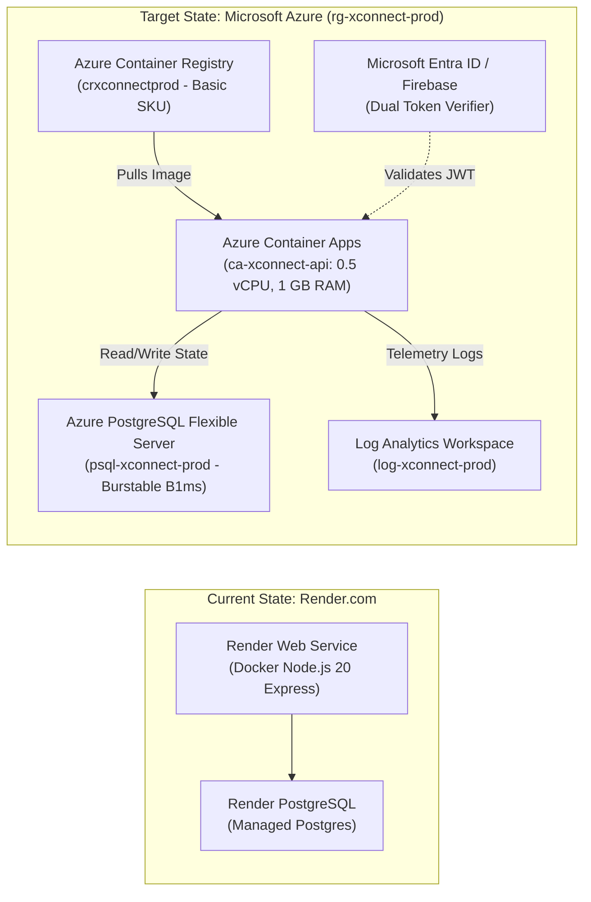

# Microsoft Azure Cloud Migration Plan: XConnect ☁️🎯

> **Executive & Technical Migration Proposal**  
> **Project:** XConnect (ConfPresence Zero-Hardware Indoor Presence & Clustering System)  
> **Prepared By:** Mohammed Thaqib Ul Rahman  
> **Document Status:** Ready for Management Review & Sign-Off  
> **Target Cloud Platform:** Microsoft Azure  
> **Target Resource Group:** `rg-xconnect-prod`  
> **Target Architecture:** Azure Container Apps (ACA) + Azure Database for PostgreSQL (Flexible Server) + Azure Container Registry (ACR)  

---

## 📑 Table of Contents

1. [Executive Summary & Business Value](#1-executive-summary--business-value)
2. [Current Architecture vs. Target Azure Architecture](#2-current-architecture-vs-target-azure-architecture)
3. [Required Azure Resources & Specifications](#3-required-azure-resources--specifications)
4. [Itemized Monthly Cost Breakdown & Sizing](#4-itemized-monthly-cost-breakdown--sizing)
5. [Manager Setup Guide (One-Time Delegation Steps)](#5-manager-setup-guide-one-time-delegation-steps)
6. [Technical Migration Execution Roadmap](#6-technical-migration-execution-roadmap)
7. [Post-Migration Verification & Smoke Testing](#7-post-migration-verification--smoke-testing)
8. [Important Technical Considerations & Safeguards](#8-important-technical-considerations--safeguards)
9. [Sign-Off & Next Steps](#9-sign-off--next-steps)

---

## 1. Executive Summary & Business Value

XConnect's backend API, graph clustering engine, and PostgreSQL persistence layer are currently hosted on Render.com (`https://xconnect-ytoj.onrender.com`). As XConnect advances toward enterprise pilots, corporate deployments, and high-reliability operations, migrating to **Microsoft Azure** delivers critical advantages:

* **Enterprise Reliability & SLA**: Backed by Microsoft's 99.95%+ uptime SLA, replacing hobby/free-tier cold starts with continuous, high-performance availability.
* **Corporate Identity & RBAC**: Centralized Role-Based Access Control (RBAC) via Microsoft Entra ID (Azure AD), ensuring access governance for engineers and administrators.
* **Database Security & Point-in-Time Recovery**: Managed PostgreSQL 16 with automated daily backups, point-in-time recovery (PITR), data encryption in transit (`SSL/TLS`), and encrypted storage at rest.
* **Uninterrupted In-Memory Clustering & Scheduled Push Notifications**: Running on Azure Container Apps ensures the in-memory graph clustering engine (`PocInferenceEngine`) and scheduled event dispatchers execute continuously.
* **Cost Efficiency**: Burstable cloud compute architecture estimated at **~$30.50 – $38.00 / month (~₹2,620 – ₹3,260 / month)**, with options to optimize below $15.00 / month for development environments.

---

## 2. Current Architecture vs. Target Azure Architecture



### Component Mapping Table

| Component | Current (Render.com) | Target (Microsoft Azure) | Technical & Business Justification |
| :--- | :--- | :--- | :--- |
| **API Compute** | Render Web Service (Docker) | **Azure Container Apps (ACA)** | Serverless container platform with auto-managed SSL certificates, automated health probes, zero-downtime rolling updates, and predictable latency. |
| **Relational Database** | Render Managed PostgreSQL | **Azure Database for PostgreSQL – Flexible Server** | PostgreSQL 16 on Burstable compute (`B1ms`), automated 7-day backups, built-in SSL enforcement, and fine-grained firewall rules. |
| **Container Registry** | Render Git-triggered build | **Azure Container Registry (ACR)** | Private, secure container storage inside Azure's private backbone network for version-tagged release images. |
| **Logs & Diagnostics** | Render Console Streams | **Azure Log Analytics / Monitor** | Structured log querying, real-time log streaming for BLE/Ultrasonic/Wi-Fi telemetry, and automated error alert triggers. |
| **Identity & Access** | Email / Google / Render Env | **Microsoft Entra ID + Firebase** | Seamless corporate single-sign-on (SSO) with dual JWT verification support for organizational and external participants. |

---

## 3. Required Azure Resources & Specifications

All services are organized under a single logical resource container: **`rg-xconnect-prod`**.

```
📁 Resource Group: rg-xconnect-prod
 ├── 🐳 Container Registry:  crxconnectprod (Basic SKU)
 ├── 🚀 Container App:        ca-xconnect-api (0.5 vCPU, 1.0 GiB RAM)
 ├── 🗄️ PostgreSQL Server:    psql-xconnect-prod (Burstable B1ms, Postgres 16)
 └── 📊 Log Analytics:        log-xconnect-prod (Pay-as-you-go)
```

1. **Resource Group (`rg-xconnect-prod`)**: Single logical perimeter for security boundaries, cost tracking, and role-based access.
2. **Azure Container Registry (`crxconnectprod`)**: Private Docker repository for production container images compiled from the monorepo `Dockerfile`.
3. **Azure Container Apps (`ca-xconnect-api`)**: Fully managed serverless container runtime hosting Express on port `3000` with **Min Replicas = 1, Max Replicas = 1** for consistent in-memory graph clustering.
4. **Azure Database for PostgreSQL Flexible Server (`psql-xconnect-prod`)**: Managed PostgreSQL 16 database storing session histories, room occurrences, device identities, stay durations, and verification records via Drizzle ORM.
5. **Azure Log Analytics (`log-xconnect-prod`)**: Unified diagnostic data store capturing real-time telemetry (BLE sightings, ultrasonic tokens, Wi-Fi cosine calculations, error traces).

---

## 4. Itemized Monthly Cost Breakdown & Sizing

The pricing model below is based on Microsoft Azure standard rates (burstable compute and consumption tiers).

| Azure Resource | SKU / Specifications | Monthly Cost (USD) | Monthly Cost (INR @ ₹86/$) | Purpose |
| :--- | :--- | :---: | :---: | :--- |
| **Azure Container Apps (ACA)** | **0.5 vCPU, 1.0 GiB RAM**<br>• 1 Dedicated Replica (24/7)<br>• *Includes 180k vCPU-seconds free monthly* | **$10.00 – $14.00** | ₹860 – ₹1,200 | Hosts Express API, in-memory graph clustering engine, and notification timers. |
| **Azure PostgreSQL (Flexible Server)** | **Burstable B1ms Tier**<br>• 1 vCore, 2 GiB RAM, 32 GiB SSD<br>• Automated 7-day backups included | **$15.50 – $17.00** | ₹1,330 – ₹1,460 | Stores sessions, rooms, devices, dwell times, and sensor verification records. |
| **Azure Container Registry (ACR)** | **Basic SKU**<br>• 10 GiB image storage included | **$5.00** | ₹430 | Stores private Docker images compiled from the monorepo `Dockerfile`. |
| **Log Analytics Workspace** | **Pay-as-you-go**<br>• First 5 GB data ingestion/month free | **$0.00 – $2.00** | ₹0 – ₹170 | Ingests and indexes container logs, BLE sightings, and API error traces. |
| **Outbound Data Transfer (Egress)** | Standard Egress<br>• First 100 GB/month outbound is free | **$0.00** | ₹0 | HTTP responses to mobile clients and admin portals. |
| **Total Estimated Net Cost** | **Standard 24/7 Production Setup** | **~$30.50 – $38.00 / mo** | **~₹2,620 – ₹3,260 / mo** | Complete enterprise-grade cloud environment. |

### Cost Optimization Options
* **Development / Non-Production Schedules:** Scaling instances down during off-hours brings total monthly cost to **under $15.00 / month (~₹1,290)**.
* **1-Year Reserved Instances:** Purchasing a 1-year reservation for Azure PostgreSQL saves **~35% to 40%** on database compute costs.

---

## 5. Manager Setup Guide (One-Time Delegation Steps)

To initialize the Azure environment, the manager/subscription owner only needs to complete **two straightforward steps in the Azure Portal**:

### Step 1: Create the Resource Group
1. Log in to the [Azure Portal](https://portal.azure.com/).
2. In the top search bar, type **Resource groups** and press Enter.
3. Click **+ Create** and configure:
   * **Subscription:** Select the active enterprise subscription.
   * **Resource group:** `rg-xconnect-prod`
   * **Region:** Select your nearest data center region (e.g., `Central India`, `East US`, or `West Europe`).
4. Click **Review + create** $\rightarrow$ **Create**.

### Step 2: Grant Team Access (Role Assignment)
1. Open the newly created Resource Group (**`rg-xconnect-prod`**).
2. In the left navigation menu, select **Access control (IAM)**.
3. Click **+ Add** $\rightarrow$ select **Add role assignment**.
4. In the **Role** tab:
   * Search for and select **Contributor** (grants permissions to deploy and manage resources without granting access to billing/subscription ownership).
   * Click **Next**.
5. In the **Members** tab:
   * Select **User, group, or service principal**.
   * Click **+ Select members**.
   * Add the engineering team's email addresses:
     - `Mohammed Thaqib Ul Rahman`
     - `Krishna`
   * Click **Select**.
6. Click **Review + assign** $\rightarrow$ **Review + assign** again to confirm.

---

## 6. Technical Migration Execution Roadmap

Once permissions are active, the engineering team executes the technical migration across 4 phases:

```
┌────────────────────────────────────────────────────────────────────────────────────────┐
│                              TECHNICAL EXECUTION PHASES                                │
└────────────────────────────────────────────────────────────────────────────────────────┘
  Phase 1: Database Provisioning & Schema Migration (Drizzle ORM)
  Phase 2: Private Container Registry & Docker Cloud Build (ACR)
  Phase 3: Azure Container App (ACA) Deployment & Secret Configuration
  Phase 4: Verification, Mobile App Cutover & End-to-End Testing
```

### Phase 1: Database Provisioning & Schema Migration
1. Provision **Azure Database for PostgreSQL (Flexible Server)** (`psql-xconnect-prod`):
   * Compute tier: Burstable `B1ms` (1 vCore, 2 GiB RAM, 32 GiB storage)
   * Version: `PostgreSQL 16`
   * Database name: `confpresence`
   * Networking: Check *"Allow public access from any Azure service within Azure"* and temporarily whitelist the deployment engineer's IP.
2. Execute Drizzle database migrations directly against the Azure instance:
   ```bash
   DATABASE_URL="postgres://<user>:<password>@psql-xconnect-prod.postgres.database.azure.com:5432/confpresence?sslmode=require" pnpm --filter @confpresence/backend db:migrate
   ```
   *Output verifies that tables (`sessions`, `rooms`, `devices`, `users`, `room_membership`, `state_change_events`, `scheduled_events`, `push_subscriptions`, `notification_logs`) are created successfully.*

### Phase 2: Container Build & Azure Container Registry
1. Provision Azure Container Registry (`crxconnectprod`, SKU: `Basic`).
2. Build and push the production Docker image using Azure CLI cloud build:
   ```bash
   az acr build --registry crxconnectprod --image xconnect-api:v1.0.0 .
   ```

### Phase 3: Azure Container App (ACA) Deployment
1. Provision Container App (`ca-xconnect-api`):
   * Environment: `env-xconnect-prod`
   * Image: `crxconnectprod.azurecr.io/xconnect-api:v1.0.0`
   * Sizing: `0.5 vCPU, 1.0 GiB RAM`
   * Ingress: **Enabled (External)** | Target Port: **`3000`**
   * Replicas: **Min = 1, Max = 1** *(ensures single-instance in-memory graph clustering state consistency and continuous scheduler execution)*
2. Configure Environment Variables:
   * `NODE_ENV`: `production`
   * `PORT`: `3000`
   * `DATABASE_URL`: `postgres://<user>:<password>@psql-xconnect-prod.postgres.database.azure.com:5432/confpresence?sslmode=require`
   * `AUTH_AUTHORITY`: `https://login.microsoftonline.com/common/v2.0` (or Entra External ID endpoint)

### Phase 4: Verification & Mobile Client Cutover
1. **API Health Check**:
   ```bash
   curl -I https://ca-xconnect-api.<region>.azurecontainerapps.io/health
   # Expected HTTP 200 OK: {"ok": true}
   ```
2. **Database Smoke Test**:
   ```bash
   curl https://ca-xconnect-api.<region>.azurecontainerapps.io/api/sessions/active
   # Expected HTTP 200 OK: {"sessions": []}
   ```
3. **Mobile Client Cutover**:
   Update `CLOUD_API_URL` in `apps/mobile/App.tsx` and `presenceService.ts` to the new Azure FQDN:
   ```typescript
   const CLOUD_API_URL = "https://ca-xconnect-api.<region>.azurecontainerapps.io";
   ```

---

## 7. Post-Migration Verification & Smoke Testing

After cutover, the following verification checklist will be executed:
1. **Presenter Broadcast**: Launch Presenter mode on Phone 1 in `Workshop 1`. Confirm acoustic token `WK-1` broadcasts and registers on the Azure backend.
2. **Attendee Zero-Touch Discovery**: Launch Attendee mode on Phone 2. Confirm discovery radar transitions dynamically to `● WORKSHOP 1 DETECTED`.
3. **Headcount & Telemetry Synchronization**: Confirm Presenter dashboard updates headcount to `1 VERIFIED ATTENDEES` in real time via Azure Container Apps.
4. **Historical Persistence**: Confirm session records, dwell times, and sensor verification flags persist in Azure PostgreSQL Flexible Server and export cleanly in admin reports.

---

## 8. Important Technical Considerations & Safeguards

| Item | Requirement | Technical Reason |
| :--- | :--- | :--- |
| **SSL Enforcement** | Always append `?sslmode=require` to `DATABASE_URL` | Azure PostgreSQL strictly blocks unencrypted traffic by default. |
| **Replica Constraint** | Maintain `minReplicas=1, maxReplicas=1` | The in-memory graph clustering algorithm requires single-instance state consistency to prevent cluster fragmentation across multiple nodes. |
| **Decommissioning Strategy** | 48-Hour Parallel Run Window | Run Render and Azure concurrently for 48 hours to validate end-to-end stability before terminating Render services to prevent double billing. |

---

## 9. Sign-Off & Next Steps

* **Prepared by:** Mohammed Thaqib Ul Rahman  
* **Review Date:** September 2026  
* **Action Required from Management:**
  1. Approve the monthly cloud budget (**~$30.50 – $38.00 / month**).
  2. Create the Resource Group `rg-xconnect-prod` and assign `Contributor` permissions to the team as outlined in [Section 5](#5-manager-setup-guide-one-time-delegation-steps).

---
*Maintained in repository: `docs/AZURE_MIGRATION_README.md`*
